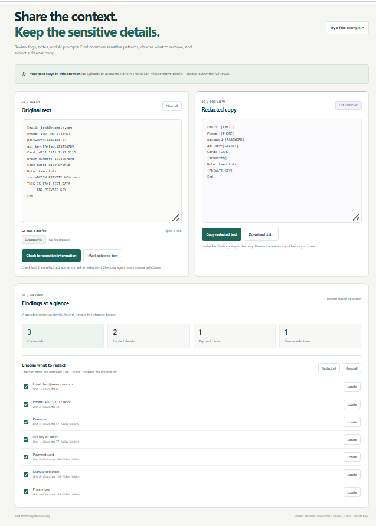
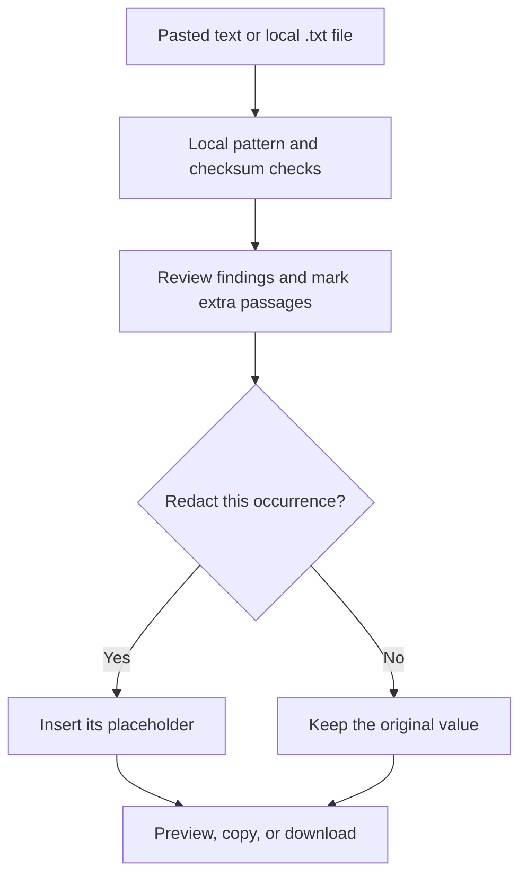

Keep the context. Protect the sensitive details.
A browser workspace for reviewing logs, notes, and AI prompts before sharing them.
 
 
 
 
Six automatic detectors · Manual redaction · Copy and download · No backend
Start here · Workspace · Features · Detection · Workflow · Privacy · Creator

🛡️ A last check before you share
A useful troubleshooting log can also contain a password. An AI prompt can include a customer’s email. A configuration note can accidentally reveal a token or private key.
File Privacy Checker helps you review that text in your browser, choose what to remove, and export a cleaner copy. Automatic findings are a starting point; you can restore false positives and manually mark details the patterns miss.
[!IMPORTANT]
No findings does not mean no sensitive information. Review the entire output before sharing. This tool uses patterns and a checksum; it does not understand every context or certify that text is safe.

🖥️ Inside the workspace

<strong>Original text → reviewed choices → redacted copy</strong>
Actual development screenshot: six automatic findings and one manual selection, using fictional data.

✨ Built for practical review
<table>
<tr>
<td width="50%" valign="top">
<h3>🔎 Find common sensitive patterns</h3>

Detect possible emails, phone numbers, labeled passwords and tokens, payment-card candidates, and complete private-key blocks.

<strong>Know what was found.</strong> Grouped counts summarize credentials, contact details, cards, and manual selections.

</td>
<td width="50%" valign="top">
<h3>☑️ Decide what stays</h3>

Use a checkbox for each occurrence, or choose <strong>Redact all</strong> and <strong>Keep all</strong>. Locate selects the original passage for closer review.

<strong>Your judgment controls the copy.</strong> Unchecked findings remain in the exported text.

</td>
</tr>
<tr>
<td width="50%" valign="top">
<h3>✍️ Mark what patterns miss</h3>

After checking, select an additional passage in the original input and mark it for replacement with <code>[REDACTED]</code>.

<strong>Review beyond the detector.</strong> Names, internal notes, and other context-sensitive details may need manual attention.

</td>
<td width="50%" valign="top">
<h3>📄 Compare and export</h3>

Review source and preview side by side on wider screens, then copy the reviewed text or download a <code>.txt</code> file.

<strong>A visible result before export.</strong> Editing the input clears the previous review and disables exports until another check.

</td>
</tr>
</table>

🚀 Start in your browser
1. Choose Code → Download ZIP on this repository and extract the folder.
2. Keep index.html, style.css, and script.js together.
3. Open index.html in a current browser.
4. Click Try a fake example to explore the tool.
No installation, account, API key, or AWS setup is needed to use the application. The demo replaces the current input with fictional text.
Step	What to do
Input	Paste text or load a UTF-8 .txt file up to 1 MiB (1,048,576 bytes).
Check	Run the check and inspect the findings and original text.
Review	Choose which occurrences to redact; manually mark any extra passage.
Export	Read the complete preview, then copy or download reviewed-copy.txt.

[!TIP]
Editing the input invalidates the previous review. Running a new check resets manual selections and checkbox choices. Clear all resets the application’s input, preview, file selection, and findings.

🔐 What it looks for
Category	Supported pattern	Replacement
Email	Common email-address formats	[EMAIL]
Phone	10–15 digits with a leading + or a recognized preceding phone label	[PHONE]
Password	Values labeled password, passwd, or pwd	[PASSWORD]
API key / token	Values labeled API key, access token, or secret key in supported forms	[SECRET]
Payment card	13–19 digits passing a Luhn checksum; all-zero strings excluded	[CARD]
Private key	Complete blocks with matching supported PEM private-key markers	[PRIVATE KEY]
Manual selection	A nonempty passage you select after checking	[REDACTED]

Quoted credential values can contain spaces. Common quoted JSON labels are supported, but escaped quotes are not fully supported. A matching card checksum does not establish a real or active account, and matching private-key markers do not validate key contents.
Read the exact rules and limitations: [Detection reference →](docs/detection.md)

⚙️ From input to reviewed copy

Findings retain their original character positions. Selected replacements run from the end of the text towards the beginning, preserving earlier positions. Overlapping automatic findings keep the first accepted detection; private-key and labeled-credential checks run first. Manual selections cannot overlap an existing finding.

🧭 Privacy with clear boundaries

Local processing. Visible choices. Human review.

Principle	What the application does
Process locally	Checks entered text in browser memory, with no upload endpoint or remote analysis service.
Keep decisions visible	Shows the original input, selected findings, and current output.
Avoid application persistence	Does not save entered text in local storage or a database.
Explain the limits	Documents missed formats, false positives, and the need for manual review.

Original values remain in the input. Credentials, cards, keys, and manual values are hidden in finding descriptions, but Locate selects them in the original input. Unchecking a finding restores it in the output.
[!NOTE]
Loading a hosted application requests its page files from the host. Copying and downloading can leave data in clipboard history or local files. Browser extensions, host request logs, and device security are outside the application’s control. This README also uses externally hosted decorative banners and badges; those images are separate from the application and do not receive the text you review.

Current scope: plain text only. No PDF, Word, image, or document-metadata inspection. Names, addresses, unlabeled credentials, unsupported phone formats, and incomplete private keys can be missed.
[Privacy details and troubleshooting →](docs/privacy.md)

🧪 Test with fictional data
Load [the final test file](samples/final-privacy-test.txt) and run a check:
- Expect six automatic findings: email, phone, password, token, card, and private key.
- Expect 3 credentials · 2 contact details · 1 payment card.
- The sample order number and ordinary paragraphs should stay intact.
- Mark Blue Orchid manually to create the seventh finding.
- Uncheck and recheck a finding, then compare copied and downloaded text with the preview.
The creator completed the development browser workflow and final sample-file checks. JavaScript syntax and simulated-DOM regression checks also passed during review. These checks cover exercised examples; they do not establish exhaustive detection, native-browser compatibility, or an independent security audit.

<strong>Run automated development checks</strong>

With Node.js 22 or newer, run from the repository folder:
node --check script.js
node tests/privacy-checker.test.cjs
No npm installation is needed. The tests execute the actual application against a simulated DOM, covering replacements, overlap handling, manual choices, exports, reset, file validation, file-read conflicts, and review controls. Native rendering, clipboard permissions, and download dialogs require separate browser checks.
GitHub Actions configuration is provided for the same checks. Check the repository’s Actions tab for its actual hosted status.

[Full validation walkthrough →](docs/validation.md)

📚 Explore the project
Resource	What you will find
[Application structure](index.html) · [Styles](style.css) · [Logic](script.js)	HTML, CSS, and vanilla JavaScript with no application runtime dependencies.
[Detection](docs/detection.md)	Patterns, priority, overlaps, and replacements.
[Validation](docs/validation.md) · [Sample](samples/final-privacy-test.txt)	Repeatable checks with fictional data.
[Privacy](docs/privacy.md)	Data handling, limitations, and troubleshooting.
[Contributing](CONTRIBUTING.md) · [Changelog](CHANGELOG.md)	Contribution guidance and implemented features.
[Security reporting](SECURITY.md) · [Responsible use](ETHICS.md)	Report defects and handle sensitive material carefully.
MIT license	Reuse and modification terms, including commercial use with the notice retained.

👩‍💻 Built by Lubaba

Lubaba Zafar
Cybersecurity project creator · File Privacy Checker
Built to make careful sharing easier—one reviewed copy at a time.

AI assisted with implementation guidance, troubleshooting, interface refinement, code review, and documentation. Lubaba performed the browser checks and final sample-file validation. The running application uses JavaScript patterns and a checksum; it does not call an AI model or send entered content to an AI service.
Have a useful improvement or a missed pattern? Open an issue with a minimal fictional example. Follow [SECURITY.md](SECURITY.md) for security-sensitive reports. Never include real credentials or personal data in public reports.

Review the source. Choose what stays. Share the reviewed copy.
Start here · Documentation · Back to top ↑

