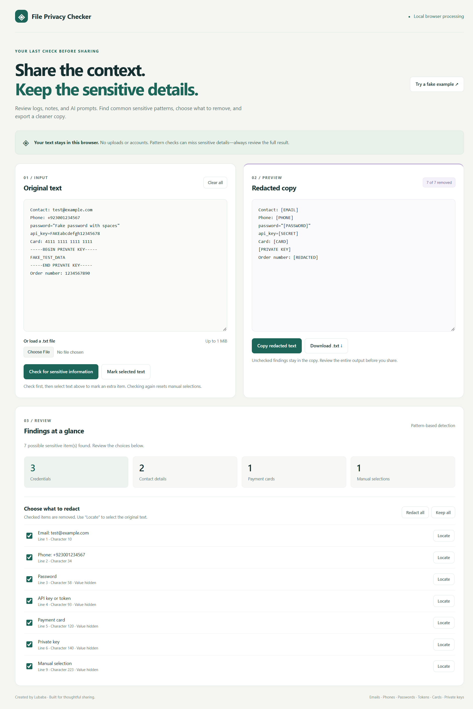
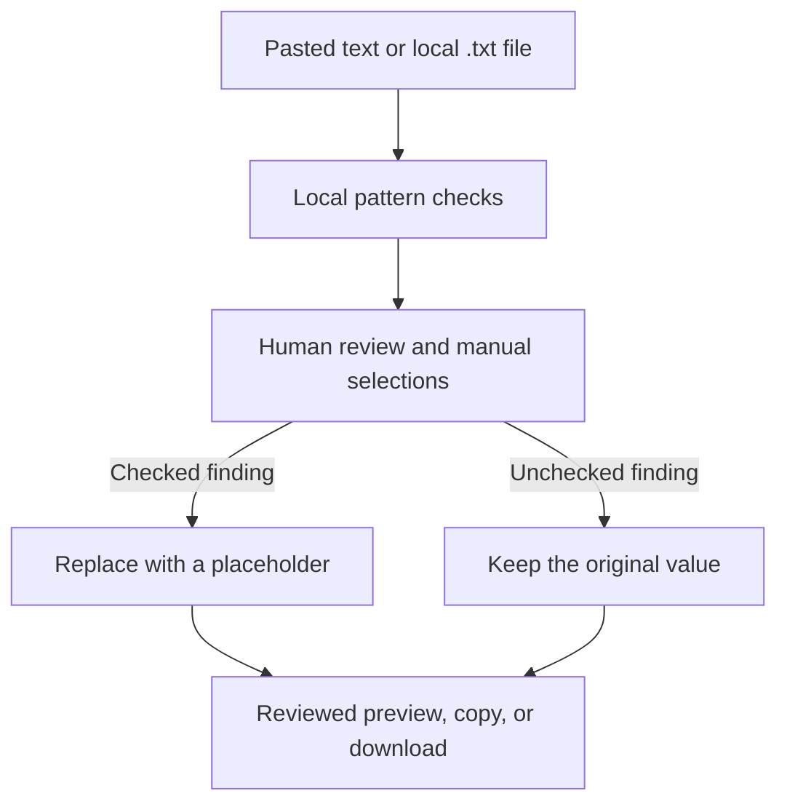

<a id="top"></a>

<div align="center">

# ◈ File Privacy Checker

### Share the context. Keep the sensitive details.

Review and redact logs, notes, and AI prompts **locally in your browser**.

** Six automatic detectors · Manual redaction · No backend**

Created by **[Lubaba](https://github.com/lubaba1513-pixel)**

[Quick start](#-quick-start) · [Workspace](#-review-workspace) · [Detection](#-what-it-detects) · [Validation](#-validation) · [Privacy](#-privacy-and-boundaries)

</div>

---

## ✦ Why this tool exists

A support log, troubleshooting note, or AI prompt can carry more than its intended context: a password, token, contact detail, or private key may be included by accident.

File Privacy Checker helps you inspect text before sharing it. It finds common patterns, creates a redacted copy, and leaves the final decision with you. You can restore a false positive or manually redact something the detectors missed.

> **A review aid, not a safety verdict.** A clean findings list does not prove that the text contains no sensitive information.

## 🖥️ Review workspace



*Actual test screenshot using fake values: six automatic findings and one manual selection.*

| Control | What it helps you do |
| --- | --- |
| Original text + redacted copy | Compare source and output side by side on wider screens. |
| Finding counts | See detected occurrences grouped as credentials, contact details, payment cards, and manual selections. |
| Per-item checkbox | Remove a finding or restore its original value. |
| Locate | Select the occurrence in the original input, including values hidden in the review list. |
| Redact all / Keep all | Apply one choice to every finding. |
| Mark selected text | Redact an extra passage that automatic detection missed. |
| Try a fake example | Replace current input with a demonstration and run a check. |
| Copy / Download | Export the current reviewed copy. |

Counts include unchecked findings. The preview badge reports how many occurrences are selected for removal. Narrow screens stack the two text panels.

## 🚀 Quick start

### Run locally

1. Download the repository ZIP using **Code → Download ZIP**, then extract it.
2. Keep `index.html`, `style.css`, and `script.js` in the same folder.
3. Open `index.html` in a current browser.
4. Click **Try a fake example** to explore the workflow.

**No package installation, API key, account, or AWS service is needed.**

### Review your own text

1. Paste text or load a UTF-8 `.txt` file up to **1 MiB** (1,048,576 bytes).
2. Click **Check for sensitive information**.
3. Review each finding. Checked items are removed; unchecked items remain.
4. Select any additional passage in the original input and click **Mark selected text**.
5. Review the entire output before copying or downloading `reviewed-copy.txt`.

Editing the input clears the old review. Running a new check resets manual selections and checkbox choices. **Clear all** resets the page.

## 🔎 What it detects

| Category | Detection rule | Replacement | Important boundary |
| --- | --- | --- | --- |
| Email | Common email address patterns | `[EMAIL]` | Unusual address formats may be missed. |
| Phone | 10–15 digits, beginning with `+` or following a recognized phone label | `[PHONE]` | Unlabeled local numbers may be missed. |
| Password | Values labeled `password`, `passwd`, or `pwd` | `[PASSWORD]` | Unlabeled or unusual formats may be missed. |
| API key / token | Values labeled API key, access token, or secret key | `[SECRET]` | Does not validate a provider or recognize every token format. |
| Payment card | 13–19 digits passing a Luhn checksum, excluding all-zero strings | `[CARD]` | A checksum does not prove that a card is real or active. |
| Private key | Complete matching PEM private key markers | `[PRIVATE KEY]` | Incomplete or differently formatted blocks may be missed. |
| Manual selection | A passage you select after checking | `[REDACTED]` | Overlaps with an existing finding are rejected. |

Quoted password and token values can contain spaces. Common quoted JSON labels are supported. Credentials, cards, private keys, and manual values are hidden in the finding descriptions; originals remain visible in the input box.

[Read the detection details →](docs/detection.md)

## ⚙️ How it works

All detection and replacement happen in the page's JavaScript. Each finding records its original character positions. Redaction works backwards through those positions so replacing one value does not shift an earlier finding.



Automatic overlaps keep the first accepted finding; private key and labeled credential checks precede contact checks. The review controls determine what appears in the exported copy.

## ✅ Validation

The interface and core workflow were tested using **fictional data** during development. The creator confirmed the combined browser test and final file test passed. These results cover the exercised samples, not every possible input or browser.

| Check | Observed result |
| --- | --- |
| Combined automatic detection | Six expected findings were redacted. |
| Normal text and order number | Normal text stayed intact; the sample order number was unchanged. |
| Manual selection | An extra marked passage became `[REDACTED]`; the count increased to seven. |
| Checkbox review | Unchecking restored a value; checking redacted it again. |
| Export | The tested downloaded copy matched the preview. |
| Updated interface | Side-by-side panels, summary counts, and reviewed output were checked in the supplied screenshot. |

JavaScript syntax and simulated-DOM checks also covered quoted credentials, bulk choices, locating a finding, input invalidation, file validation, and pending file-read conflicts. Simulated-DOM checks do not substitute for browser rendering tests.

**Reproduce the final test:** load [the fake test file](samples/final-privacy-test.txt), run a check, and expect six findings. Mark **Blue Orchid** manually to create the seventh.

[Full validation procedure and expected output →](docs/validation.md)

## 🔐 Privacy and boundaries

| Area | Behavior |
| --- | --- |
| Processing | Runs locally in browser memory. |
| Application uploads | No text upload or remote detection service. |
| Accounts and analytics | No sign-in or application analytics. |
| Browser storage | The application does not persist input in local storage or a database. |
| Copy | Places reviewed output on the system clipboard. |
| Download | Saves reviewed output as a file on your device. |

Opening a hosted page still requests its HTML, CSS, and JavaScript from the host. The application does not send your entered text as part of its review workflow. Browser extensions, clipboard history, and device security are outside the tool's control.

**Current limits:** plain text only; no PDF, Word, image, or metadata inspection. Names, addresses, unlabeled credentials, escaped quoted values, unsupported phone formats, and incomplete private keys can be missed. Unrelated identifiers can resemble card numbers.

[Privacy details and troubleshooting →](docs/privacy.md)

## 🧠 AI-assisted development

AI assisted with implementation guidance, troubleshooting, interface refinement, code review, and documentation. Lubaba performed the browser checks and final sample-file validation.

The running tool uses **JavaScript pattern matching and a Luhn checksum**. It does not call an AI model, infer meaning from text, or send content to an AI service. Manual review remains part of the workflow.

## 📂 Repository guide

| File or folder | Purpose |
| --- | --- |
| [`index.html`](index.html) | Page structure, controls, and accessibility labels. |
| [`style.css`](style.css) | Responsive layout and visual design. |
| [`script.js`](script.js) | Detection, review state, redaction, local file loading, and export. |
| [`assets/workspace.png`](assets/workspace.png) | Actual interface test screenshot. |
| [`samples/final-privacy-test.txt`](samples/final-privacy-test.txt) | Fictional data for repeatable manual testing. |
| [`docs/detection.md`](docs/detection.md) | Supported patterns and overlap behavior. |
| [`docs/validation.md`](docs/validation.md) | Test procedure and expected results. |
| [`docs/privacy.md`](docs/privacy.md) | Data handling, limitations, and troubleshooting. |
| [`tests/privacy-checker.test.cjs`](tests/privacy-checker.test.cjs) | Runnable simulated-DOM regression checks. |
| [`.github/workflows/checks.yml`](.github/workflows/checks.yml) | Prepared syntax and regression CI workflow. |

**Stack:** HTML · CSS · Vanilla JavaScript · Browser APIs. No runtime dependencies. Node.js is needed only for the optional automated development checks.

## 🧪 Automated regression checks

For contributors with Node.js 22 or newer:

```sh
node --check script.js
node tests/privacy-checker.test.cjs
```

No npm install is needed. The regression script runs the actual JavaScript against a simulated DOM. A prepared [GitHub Actions workflow](.github/workflows/checks.yml) runs the same checks on pushes and pull requests. Hosted CI status must be confirmed after uploading it; these checks do not validate native browser rendering or permissions.

## 🤝 Responsible use and project policies

| Document | Purpose |
| --- | --- |
| [MIT license](LICENSE) | Permits reuse and modification, including commercial use, with the license notice retained. |
| [Responsible use](ETHICS.md) | Privacy-conscious handling, fictional examples, and honest sharing. |
| [Security reporting](SECURITY.md) | How to report defects without exposing sensitive information. |
| [Contributing](CONTRIBUTING.md) | Setup, regression checks, and focused contributions. |
| [Changelog](CHANGELOG.md) | Implemented changes and repository preparation status. |

Responsible-use guidance does not modify the MIT license. This project makes no independent security-audit, certification, or complete-detection claim.

## 💬 Feedback

Found a missed pattern or false positive? [Open an issue](https://github.com/lubaba1513-pixel/file-privacy-checker/issues) with a minimal **fake example**, the expected result, actual result, and browser version. Do not include real passwords, tokens, private keys, or personal data.

---

**Created by [Lubaba](https://github.com/lubaba1513-pixel)** · Review before you share.

[Back to top ↑](#top)
